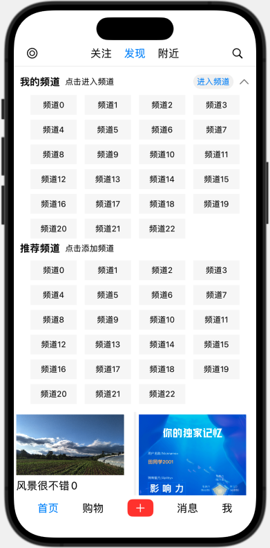

# Small Red Book

## 介绍

使用 SwiftUI 开发的小红书 IOS 原生手机 App。

## 实现功能

- 首页
  - 发现
  - 关注
  - 附近
  - 标签选择弹窗
- 消息

## 效果图

|                     |                     |                       |
| ------------------- | ------------------- | --------------------- |
|  |  |  |

## 开始时间

2024-03-13

## 贡献者

- [Tyh2001](https://github.com/Tyh2001)
